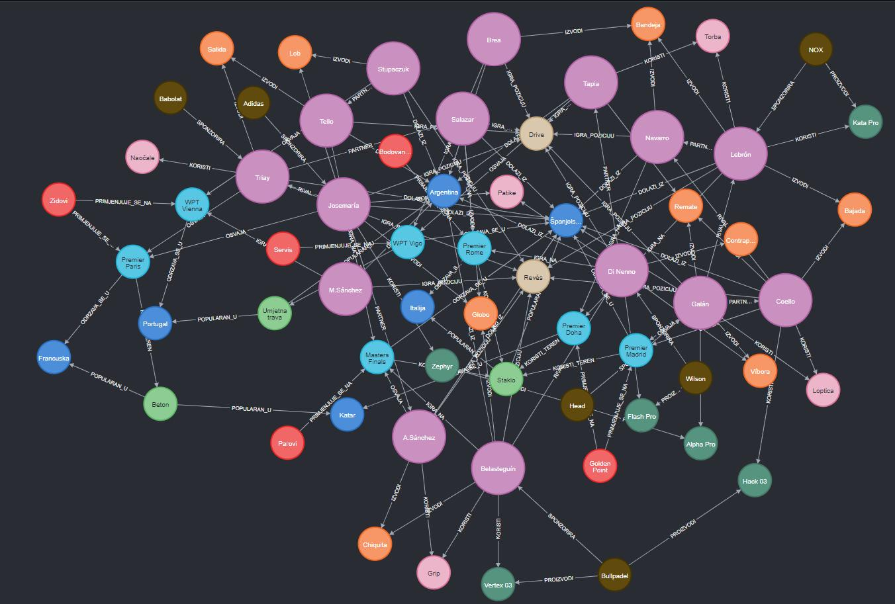
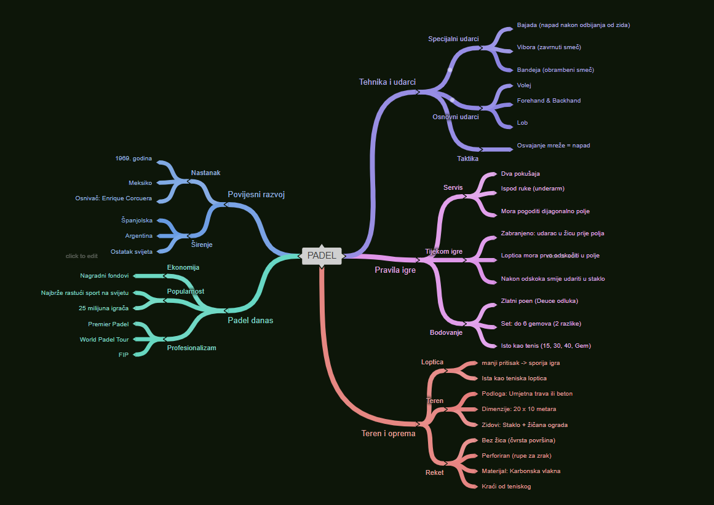

# Padel Knowledge Graph

A knowledge graph modeling the sport of padel (players, tournaments, brands, equipment, techniques) built in Neo4j.

## Demo

🎥 [Watch the demo](https://youtu.be/uHaT3ni-C5Y)

## How it works

Padel knowledge is first organized into a mind map, then modeled as a graph with **10 node classes** (players, tournaments, locations, brands, equipment, shots, positions, courts, rules) and **256 relationships** — capturing things a flat hierarchy can't, like a player having a sponsor, teammates, rivals, and a home country all at once.

See [`queries.cypher`](queries.cypher) for example queries. Sample:

\`\`\`cypher
// Which brands sponsor players from Spain?
MATCH (b:Brend)-[:SPONZORIRA]->(i:Igrac)-[:DOLAZI_IZ]->(l:Lokacija)
WHERE l.naziv = 'Španjolska'
RETURN b.naziv, i.naziv, l.naziv;
\`\`\`

## Tech stack

## Note

Two Cypher queries had their `WHERE` clause cropped in the original report screenshots and were completed here based on context.

## License

MIT
